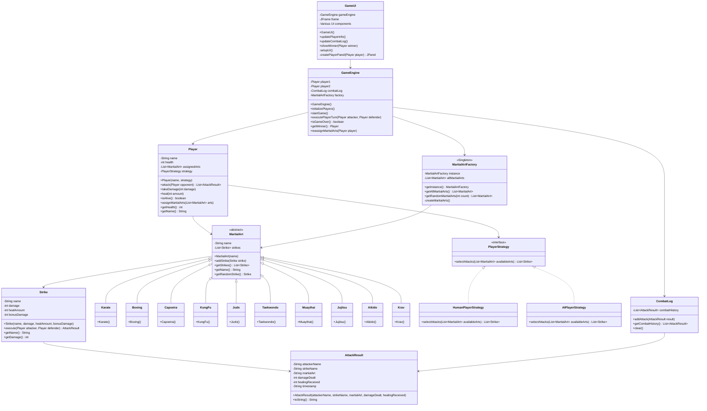

# Martial Arts Fighting Game - Class Diagram

```mermaid
classDiagram
    class Strike {
        -String name
        -int damage
        -int healAmount
        -int bonusDamage
        +Strike(name, damage, healAmount, bonusDamage)
        +execute(Player attacker, Player defender) AttackResult
        +getName() String
        +getDamage() int
    }

    class MartialArt {
        <<abstract>>
        -String name
        -List~Strike~ strikes
        +MartialArt(name)
        +addStrike(Strike strike)
        +getStrikes() List~Strike~
        +getName() String
        +getRandomStrike() Strike
    }

    class Karate {
        +Karate()
    }

    class Boxing {
        +Boxing()
    }

    class Capoeira {
        +Capoeira()
    }

    class KungFu {
        +KungFu()
    }

    class Judo {
        +Judo()
    }

    class Taekwondo {
        +Taekwondo()
    }

    class Muaythai {
        +Muaythai()
    }

    class Jujitsu {
        +Jujitsu()
    }

    class Aikido {
        +Aikido()
    }

    class Krav {
        +Krav()
    }

    class Player {
        -String name
        -int health
        -List~MartialArt~ assignedArts
        -PlayerStrategy strategy
        +Player(name, strategy)
        +attack(Player opponent) List~AttackResult~
        +takeDamage(int damage)
        +heal(int amount)
        +isAlive() boolean
        +assignMartialArts(List~MartialArt~ arts)
        +getHealth() int
        +getName() String
    }

    class PlayerStrategy {
        <<interface>>
        +selectAttacks(List~MartialArt~ availableArts) List~Strike~
    }

    class HumanPlayerStrategy {
        +selectAttacks(List~MartialArt~ availableArts) List~Strike~
    }

    class AIPlayerStrategy {
        +selectAttacks(List~MartialArt~ availableArts) List~Strike~
    }

    class AttackResult {
        -String attackerName
        -String strikeName
        -String martialArt
        -int damageDealt
        -int healingReceived
        -String timestamp
        +AttackResult(attackerName, strikeName, martialArt, damageDealt, healingReceived)
        +toString() String
    }

    class MartialArtFactory {
        <<Singleton>>
        -MartialArtFactory instance
        -List~MartialArt~ allMartialArts
        +getInstance() MartialArtFactory
        +getAllMartialArts() List~MartialArt~
        +getRandomMartialArts(int count) List~MartialArt~
        -createMartialArts()
    }

    class CombatLog {
        -List~AttackResult~ combatHistory
        +addAttack(AttackResult result)
        +getCombatHistory() List~AttackResult~
        +clear()
    }

    class GameEngine {
        -Player player1
        -Player player2
        -CombatLog combatLog
        -MartialArtFactory factory
        +GameEngine()
        +initializePlayers()
        +startGame()
        +executePlayerTurn(Player attacker, Player defender)
        +isGameOver() boolean
        +getWinner() Player
        +reassignMartialArts(Player player)
    }

    class GameUI {
        -GameEngine gameEngine
        -JFrame frame
        -Various UI components
        +GameUI()
        +updatePlayerInfo()
        +updateCombatLog()
        +showWinner(Player winner)
        -setupUI()
        -createPlayerPanel(Player player) JPanel
    }

    MartialArt <|-- Karate
    MartialArt <|-- Boxing
    MartialArt <|-- Capoeira
    MartialArt <|-- KungFu
    MartialArt <|-- Judo
    MartialArt <|-- Taekwondo
    MartialArt <|-- Muaythai
    MartialArt <|-- Jujitsu
    MartialArt <|-- Aikido
    MartialArt <|-- Krav

    PlayerStrategy <|.. HumanPlayerStrategy
    PlayerStrategy <|.. AIPlayerStrategy

    Player --> PlayerStrategy
    Player --> MartialArt
    Strike --> AttackResult
    MartialArt --> Strike
    GameEngine --> Player
    GameEngine --> CombatLog
    GameEngine --> MartialArtFactory
    GameUI --> GameEngine
    CombatLog --> AttackResult
    MartialArtFactory --> MartialArt
```