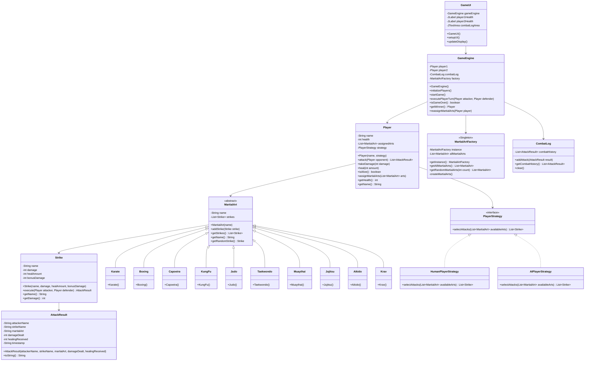

# 🥋 Martial Arts Fighting Game


Un juego de combate de artes marciales desarrollado en Java que implementa múltiples patrones de diseño y ofrece una experiencia de combate por turnos entre un jugador humano y una IA.

## 📋 Tabla de Contenidos

- [Características](#-características)
- [Tecnologías](#-tecnologías)
- [Arquitectura](#-arquitectura)
- [Instalación](#-instalación)
- [Cómo Jugar](#-cómo-jugar)
- [Artes Marciales](#-artes-marciales)
- [Estructura del Proyecto](#-estructura-del-proyecto)
- [Patrones de Diseño](#-patrones-de-diseño)
- [Diagrama de Clases](#-diagrama-de-clases)
- [Contribución](#-contribución)
- [Licencia](#-licencia)

## 🎮 Características

- **Combate por turnos** entre jugador humano vs IA
- **10 artes marciales diferentes** cada una con técnicas únicas
- **Sistema de salud dinámico** con efectos de curación
- **Interfaz gráfica intuitiva** desarrollada con Swing
- **Log de combate en tiempo real** para seguir la acción
- **Sistema de reasignación** de artes marciales durante el juego
- **Estrategias personalizables** para jugadores y IA

## 🛠 Tecnologías

- **Java 17+**
- **Spring Boot 3.x**
- **Swing** (GUI)
- **Maven** (Gestión de dependencias)
- **Mermaid** (Diagramas)

## 🏗 Arquitectura

El proyecto implementa una arquitectura limpia basada en patrones de diseño:

- **Strategy Pattern**: Para las diferentes estrategias de combate (Humano vs IA)
- **Factory Pattern**: Para la creación de artes marciales
- **MVC Pattern**: Separación clara entre lógica de negocio, vista y control

## 📦 Instalación

### Prerrequisitos
- Java 17 o superior
- Maven 3.6+

### Pasos de instalación

1. **Clonar el repositorio**
```bash
git clone https://github.com/Preko700/strategy.git
cd strategy
```

2. **Compilar el proyecto**
```bash
mvn clean compile
```

3. **Ejecutar el juego**
```bash
mvn spring-boot:run
```

Alternativamente, puedes ejecutar la interfaz gráfica directamente:
```bash
mvn exec:java -Dexec.mainClass="com.example.demo.GameUI"
```

## 🎯 Cómo Jugar

1. **Inicio del juego**: Al iniciar, cada jugador recibe 3 artes marciales aleatorias
2. **Selección de arte marcial**: El jugador humano elige un arte marcial del menú desplegable
3. **Ataque**: Presiona el botón "Attack!" para ejecutar entre 3-6 técnicas aleatorias
4. **Turno de IA**: La IA responde automáticamente con sus propios ataques
5. **Vida**: Cada jugador comienza con 200 puntos de vida
6. **Victoria**: El primer jugador en reducir la vida del oponente a 0 gana
7. **Reasignación**: Usa "Re Asignar" para obtener nuevas artes marciales

### Controles
- **Menú desplegable**: Seleccionar arte marcial
- **Attack!**: Ejecutar ataque
- **Re Asignar**: Obtener nuevas artes marciales
- **New Game**: Iniciar nueva partida

## 🥋 Artes Marciales

El juego incluye 10 artes marciales tradicionales:

| Arte Marcial | Origen | Características |
|--------------|---------|-----------------|
| **Karate** | Japón | Técnicas de golpeo lineales |
| **Boxing** | Occidental | Puñetazos potentes |
| **Capoeira** | Brasil | Movimientos fluidos y acrobáticos |
| **Kung Fu** | China | Técnicas variadas y filosóficas |
| **Judo** | Japón | Técnicas de proyección |
| **Taekwondo** | Corea | Patadas de alta velocidad |
| **Muay Thai** | Tailandia | "El arte de las ocho extremidades" |
| **Jiu-Jitsu** | Brasil/Japón | Técnicas de suelo y sumisión |
| **Aikido** | Japón | Redirección de la fuerza del oponente |
| **Krav Maga** | Israel | Sistema de combate militar |

Cada arte marcial tiene técnicas únicas con diferentes valores de:
- **Daño**: Puntos de vida que resta al oponente
- **Curación**: Puntos de vida que restaura al atacante
- **Daño bonus**: Daño adicional especial

## 📁 Estructura del Proyecto

```
src/main/java/com/example/demo/
├── DemoApplication.java      # Aplicación Spring Boot principal
├── GameEngine.java           # Motor del juego y lógica principal
├── GameUI.java              # Interfaz gráfica Swing
├── Player.java              # Clase jugador
├── PlayerStrategy.java      # Interfaz de estrategia
├── HumanPlayerStrategy.java # Estrategia para jugador humano
├── AIPlayerStrategy.java    # Estrategia para IA
├── MartialArt.java         # Clase abstracta arte marcial
├── MartialArtFactory.java  # Factory para crear artes marciales
├── Strike.java             # Clase técnica/golpe
├── AttackResult.java       # Resultado de ataque
├── CombatLog.java          # Log de combate
└── martial-arts/           # Implementaciones específicas
    ├── Karate.java
    ├── Boxing.java
    ├── Capoeira.java
    └── ... (otras artes marciales)
```

## 🎨 Patrones de Diseño

### Strategy Pattern
```java
public interface PlayerStrategy {
    List<Strike> selectAttacks(List<MartialArt> availableArts, MartialArt selectedArt);
}
```
- **HumanPlayerStrategy**: Permite al jugador elegir el arte marcial
- **AIPlayerStrategy**: IA que selecciona aleatoriamente artes marciales

### Factory Pattern
```java
public class MartialArtFactory {
    public List<MartialArt> getRandomMartialArts(int count) {
        // Crea artes marciales aleatorias
    }
}
```

### Template Method Pattern
```java
public abstract class MartialArt {
    // Métodos base comunes para todas las artes marciales
}
```

## 📊 Diagrama de Clases



## 🤝 Contribución

¡Las contribuciones son bienvenidas! Para contribuir:

1. Fork el proyecto
2. Crea una rama para tu feature (`git checkout -b feature/AmazingFeature`)
3. Commit tus cambios (`git commit -m 'Add some AmazingFeature'`)
4. Push a la rama (`git push origin feature/AmazingFeature`)
5. Abre un Pull Request

### Ideas para contribuir
- Agregar nuevas artes marciales
- Implementar efectos especiales para técnicas
- Mejorar la IA con estrategias más inteligentes
- Agregar sonidos y efectos visuales
- Implementar modo multijugador
- Agregar sistema de puntuación/ranking

## 📄 Licencia

Este proyecto está bajo la Licencia MIT. Ver el archivo [LICENSE](LICENSE) para más detalles.

---

## 🚀 Próximas Características

- [ ] Sistema de experiencia y niveles
- [ ] Combos especiales
- [ ] Modo torneo
- [ ] Customización de personajes
- [ ] Efectos de sonido
- [ ] Animaciones mejoradas

**¡Disfruta del combate!** 🥋⚔️
